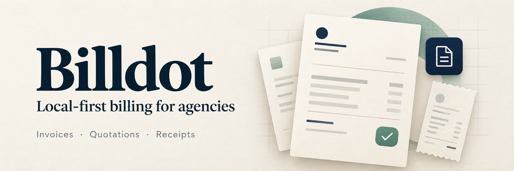

# Billdot

Local billing for a small agency. Invoices, quotations, proforma invoices, receipts, delivery notes and credit notes, in A4, US Letter, A5 and 80mm or 58mm thermal sizes.

Everything runs on your own computer. Your data stays in `data/billdot.db`.

## Run it

You need Node 22.13 or newer.

```bash
npm install
npm start
```

Open http://localhost:4321. The first visit asks for a workspace password and your business name. Setup only works from the computer running the app.

The terminal also prints a "Same Wi-Fi" address. Open it on your phone or another laptop on the same network.

## Share a link that works anywhere

Install cloudflared once (`brew install cloudflared` on a Mac). Then do one of these:

1. Run `npm run share` instead of `npm start`.
2. Or go to Settings > Public link and press Turn on public link.

You get a temporary `trycloudflare.com` address and a QR code. Client links and emails use it while it runs. It changes every time you start it, so links sent earlier stop working after a restart.

Anyone with the address only sees the bills you share and the sign-in page. Everything else needs your password.

## Email bills to clients

Go to Settings > Email and fill in your SMTP details. For Gmail:

1. Turn on 2-Step Verification for your Google account.
2. Create an app password at https://myaccount.google.com/apppasswords.
3. Use host `smtp.gmail.com`, port `465`, your Gmail address as the user, and the app password.
4. Press Send a test email.

Settings > Automation sends payment reminders a set number of days after the due date (1, 7 and 14 by default) and creates recurring invoices on schedule. The app has to be running for these to go out.

## What it does

- Remembers clients and items, with their last rate, and suggests them as you type.
- Live preview while you edit, numbered per document type (INV-2026-0001 and so on).
- Client page with the amount due, a UPI QR code, an optional payment link, an "I have paid" button and Accept or Decline for quotations.
- Part payments, mark as paid (and Mark unpaid to undo it), convert a quotation into an invoice or an invoice into a receipt.
- Send by email or WhatsApp, or copy the link. Print or save as PDF from the browser.
- Dashboard with outstanding, overdue and collected figures, plus an activity feed.
- Export everything as JSON from Settings > Backup.

## More than one business

Settings > Businesses lists every business with its ID (B01, B02 and so on), its invoice count, billed, collected and due totals, and the date of its last bill. Click Bills on a row to see only that business's documents.

Add business creates a new one with its own details, logo, UPI ID, bank details and number series, like B02-INV-2026-0001. The default business is used for new bills. When you have more than one, the editor shows a "Sending from" picker, and the Documents list gets a business filter.

## Payment proofs

Payment proofs turn a payment into a page you can share. New proofs default to **Payment sent**, with the recipient shown as **to** and the sender as **from**. Choose **Payment received** for incoming payments.

1. Open Payment proofs > New proof, or click Payment proof on an invoice.
2. Add the UPI screenshot if you have one (drop it, paste it or pick it), then fill in the amount, date, method and UTR.
3. Choose the payment direction and proof icon. Only incoming payments offer "Record this incoming payment on the bill"; tick it to reduce the invoice balance. Sent proofs do not change the bill's balance.
4. Create the page. You get a `/p/...` link to share on WhatsApp, and Save image downloads a 1080px-wide PNG. The receipt is 1080x1350; an included screenshot extends it below the receipt.

The app reads the screenshot on your computer and fills the details it can recognise, including separate sender and receiver names. Review the amount, date, names and UTR before creating the page; unclear or unfamiliar screenshots may need manual entry. Your edits are preserved while it reads. Dark-theme receipts (PhonePe, HDFC and similar) get a second, high-contrast reading when the first one misses something.

To make many proofs at once, open Payment proofs > Bulk upload and drop up to 30 screenshots. Each one is read in turn and becomes its own proof. Review every row, untick any you don't want (repeated UTRs are unticked for you), then create them all in one click.

Details to show lets you hide the sender, receiver, transaction ID, amount, date, method, linked bill or note. These choices apply to the preview, shared page and saved image, and can also be changed after creating a proof. The original screenshot still contains its own details.

The screenshot stays private until you tick "Include screenshot as payment proof", since it can show account details. When selected, it appears in the preview, shared page and saved image. Deleting a proof page does not remove the payment from the invoice.

## Other settings

Settings > Appearance offers **Billdot** and **Notion — minimal** styles throughout the app, bills, printed documents, shared pages and saved payment images. Notion uses flat surfaces, fine lines and quiet typography. Choose a default proof icon (direction arrow, simple check, circle check or dot matrix), or change it on an individual proof.

Appearance also changes the font throughout the app, documents, shared pages and saved payment images. Choose Billdot original, Space Grotesk, Space Mono, System sans, Arial or Classic serif. Notion uses system typography when the original font is selected. Fonts work offline.

- `PORT` changes the port (default 4321).
- `DATA_DIR` changes where the database is stored (default `./data`).

## Tests

```bash
npm test
```
